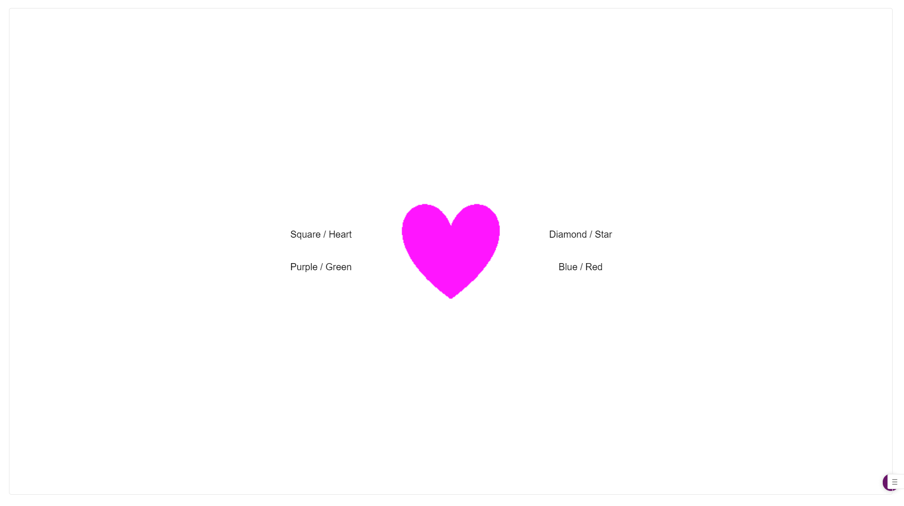

# Cued Task Switching V1.2 for Lab.js

This respository hosts a cued task switching paradigm. For online data collection, the task needs to be integrated into Qualtrics or other survey hosting service. Insert the url: 

https://cogyamaguchi.github.io/CuedTaskSwitchV1/ 

in a sruvey. See the instructions [here](https://labjs.readthedocs.io/en/latest/learn/deploy/3a-qualtrics.html) to learn how you can integrate a Lab.js experiment into a Qualtrics survey. Data will be saved as survey responses.

## Task parameters
The experiment consists of two tasks, colour and shape tasks. Participants are presented with a task cue that lasts for 1000 ms and then a target that lasts for up to 2000 ms or until a response is made. The task cue is either 'COLOUR' or 'SHAPE,' and the target is a coloured shape. The colour can be blue, green, red, or purple; the shape can be square, diamond, heart, or start. The response keys are 'c' or 'm' (i.e., left and right keys on a QUARTY keyboard). A set of two colours and two shapes are randomly selected for each participant and are assigned to either of the response keys; the remaining colours and shapes are assgined to the other key. The assigned colours/shapes are shown on the respective side of the target during the trial (see Figure 1).

Task cue is randomly selected with an equal probability on each trial. All colours and shapes are randomly chosen on each trial as well, but feature repetitions are not allowed; that is, the target colour and shape are always different from those on the immediately preceding trial. To have an equal probability of response congruent and incongruent trials (i.e., target colour and shape indicate the same response or different responses), there is a 50% chance of selecting an alternative colour/shape that is assigned to the same response as that on the preceding trial, 50% chance of selecting either of the colours/shapes that are assigned to the other response.

Response time is an interval between target onset and a keypress. 

There is a block of 24 practice trials (which can be repeated only once, if participants choose to do so), followed by three blocks of 96 trials. A session takes less than 30 minutes (this can vary depending on response time and the length of self-paced breaks between test blocks).

***Figure 1. Example of a stimulus display***

